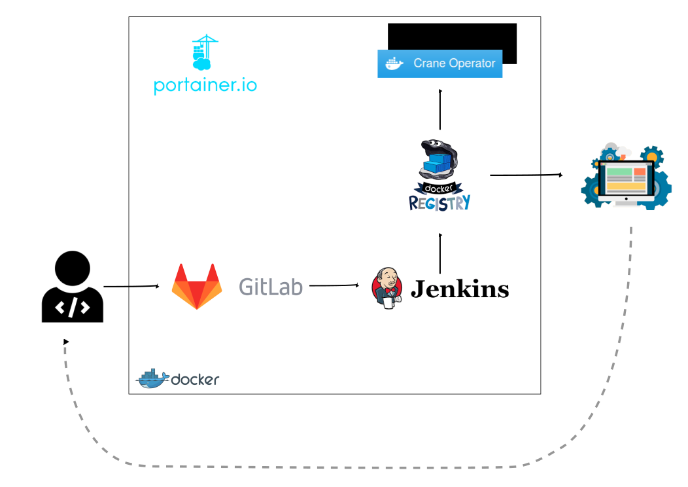

# Continuous Integration / Continuous Delivery
The intended audience of this article is anyone who are interested to deploy a simple environment for continuous integration or delivery, and to put in practices its principles.
In case you would like to know or learn anything about continuous integration or delivery, go to [References](#references) section, which list some interesting links. The article does not treat these subjects.

This environment aims to provide a set of components or tools which let you to put in practice how continuous delivery approach could improve software developement, automating the release process.
The main components are Jenkins, used for task automation and orchestration; GitLab, as a source code management system; and finally, Docker Registry, where are pushed the new releases' images. But there are some other optional components.

> Note: This environment has been thought for testing, learning or developing purposes, then is not recomended to use it on a productive environment.

## Deployment
The deployment of whole environment is done over Vagrant, using vagrant-berkshelf plugin and following the continuous_delivery cookbook, written specificaly for this purpose. You could read about continuous_delivery cookbook [here](docs/cookbook.md).

The cookbook installs Docker engine on the host, builds or pulls the required docker images locally and finally create a container for each component. Even more, all components have it own systemd service 

## References
- [https://www.madetech.com/blog/continuous-delivery-with-jenkins](https://www.madetech.com/blog/continuous-delivery-with-jenkins)
- [https://www.trainingdevops.com/training-material/advance-docker-training/using-jenkins-with-docker-container](https://www.trainingdevops.com/training-material/advance-docker-training/using-jenkins-with-docker-container)
- [https://blog.philipphauer.de/tutorial-continuous-delivery-with-docker-jenkins/#setting-up-a-simple-continuous-delivery-pipeline-with-docker](https://blog.philipphauer.de/tutorial-continuous-delivery-with-docker-jenkins/#setting-up-a-simple-continuous-delivery-pipeline-with-docker)

## License and Authors

Author:: Aleix Penella (aleix.penella [at] gmail.com)
