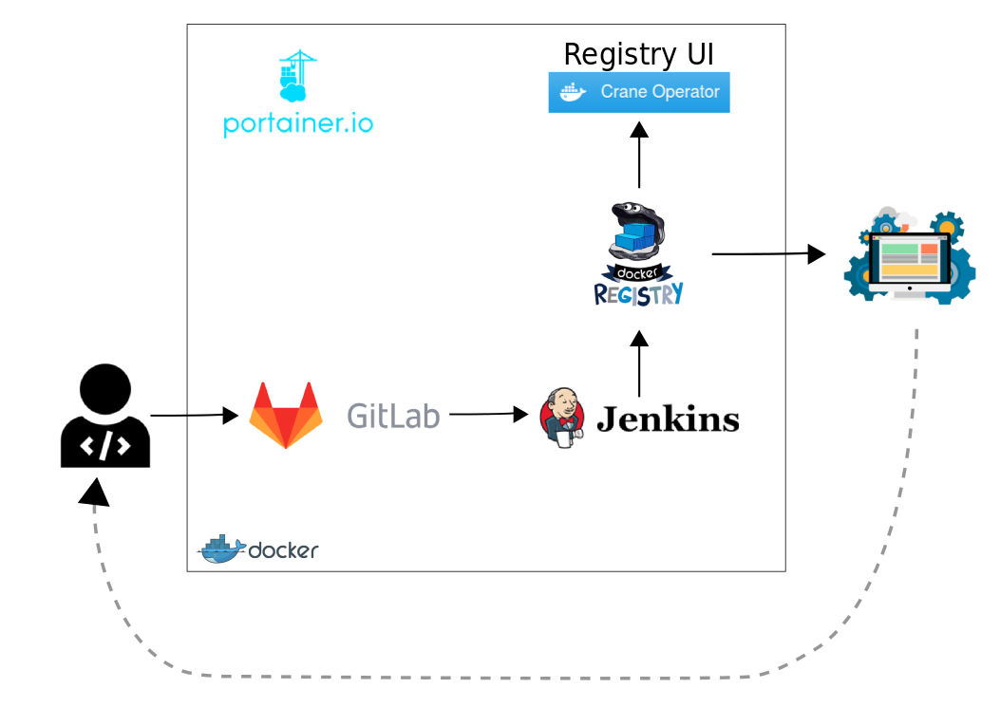

# Continuous Integration / Continuous Delivery
This environment aims to provide a set of components or tools which let you to put in practice how continuous delivery approach could improve software developement, automating the release process.

The intended audience of this article is anyone interested in to have a basic environment to put in practice the continuous integration or delivery principles.
The article does not treat continuous integration or delivery in depth. In case you would like to know or learn anything about on these subjects, go to [references](#references) section which lists some interesting links.

> Note: This environment has been thought for testing, learning or developing purposes, then is not recomended to use it on a productive environment.

## Deployment
The main components are Jenkins, used for task automation and orchestration; GitLab, as a source code management system; and finally, Docker Registry, where are pushed the new releases' images. 
There are some other optional components, like Portainer, to manage the Docker engine, or Registry UI, which helps to make the Docker Registry's management easier.

The deployment of whole environment is done over Vagrant, using vagrant-berkshelf plugin and following the continuous_delivery cookbook, written specificaly for this purpose. You could read about continuous_delivery cookbook [here](docs/cookbook.md).

The environmnet has an easy deployment, you have to run ``` vagrant up ``` for the environemnt to be running.
The cookbook installs Docker engine on the host. Over Docker engine are built or pulled the required docker images and is created a container for each component. To manage the components separetely, a systemd servicie is created for each one.

Once every component is running, the environment looks like as the scheme below.


## Use Case
The common use case will be described using the above scheme.
1. Developement team pushes a new feature on GitLab.
2. Gitlab triggers a Jenkins job execution.
3. The Jenkins job is a pipeline that tests and builds a new release of the application.
4. A new docker image for this release is created and pushed to Docker Registry.
5. The image ready to be deployed.
6. Once the new release is used by user, developement team could have a feedback about new feature.
7. Developement team has been always working on new features or changes.

## References
- [https://www.madetech.com/blog/continuous-delivery-with-jenkins](https://www.madetech.com/blog/continuous-delivery-with-jenkins)
- [https://www.trainingdevops.com/training-material/advance-docker-training/using-jenkins-with-docker-container](https://www.trainingdevops.com/training-material/advance-docker-training/using-jenkins-with-docker-container)
- [https://blog.philipphauer.de/tutorial-continuous-delivery-with-docker-jenkins/#setting-up-a-simple-continuous-delivery-pipeline-with-docker](https://blog.philipphauer.de/tutorial-continuous-delivery-with-docker-jenkins/#setting-up-a-simple-continuous-delivery-pipeline-with-docker)

## License and Authors

Author:: Aleix Penella (aleix.penella [at] gmail.com)