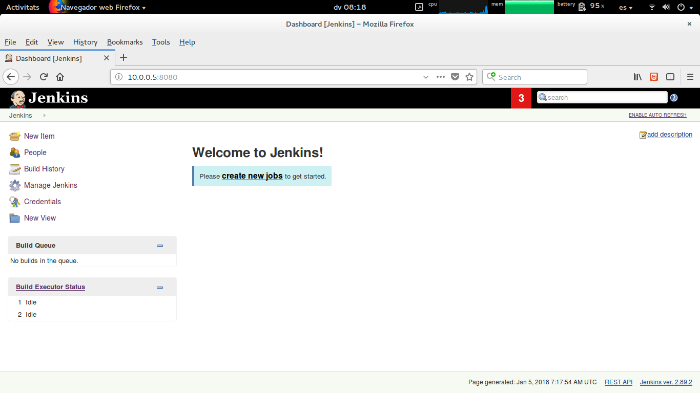

# Continuous Integration / Continuous Delivery
This environment aims to provide a set of components or tools which let you to put in practice how continuous delivery approach could improve software developement, automating the release process.

The intended audience of this article is anyone interested in to have a basic environment to put in practice the continuous integration or delivery principles.
The article does not treat continuous integration or delivery in depth. In case you would like to know or learn anything about on these subjects, go to [references](#references) section which lists some interesting links.

> Note: This environment has been thought for testing, learning or developing purposes, then is not recomended to use it on a productive environment.

## Deployment
The main components are Jenkins, used for task automation and orchestration; GitLab, as a source code management system; and finally, Docker Registry, where are pushed the new releases' images. 
There are some other optional components, like Portainer, to manage the Docker host, or Registry UI (Crane Operator), which helps to make the Docker Registry's management easier.

The whole environment deployment is done over Vagrant, using vagrant-berkshelf plugin and following the continuous_delivery cookbook, written specificaly for this purpose. You could read about continuous_delivery cookbook [here](docs/cookbook.md).

To create and start the environemnt, just run ``` vagrant up ```.
The cookbook installs Docker-ce on the host. Over Docker host are built or pulled the required Docker images, for each component. Docker containeres are also created and started. To easily manage each component, a systemd service is created for all of them.

Once every component is running, the environment looks like as the scheme below.


Each component is already accessible using next URLs:
**Jenkins:** http://10.0.0.5:8080


**Gitlab:** http://10.0.0.5:8080


**Portainer:** http://10.0.0.5:9000


**Registry UI (crane operator):** http://10.0.0.5:5080


## Common scenario
A common scenario for the current environemnt is described below.
1. Developement team pushes a new feature on GitLab.
2. Gitlab triggers a Jenkins job execution.
3. The Jenkins job is a pipeline that tests and builds a new release of the application.
4. A new docker image for this release is created and pushed to Docker Registry.
5. The image is ready to be deployed.
6. Once the new release is used by user, developement team could have a feedback about new feature.
7. Developement team has been always working on new features or changes.

## References
- [https://www.madetech.com/blog/continuous-delivery-with-jenkins](https://www.madetech.com/blog/continuous-delivery-with-jenkins)
- [https://www.trainingdevops.com/training-material/advance-docker-training/using-jenkins-with-docker-container](https://www.trainingdevops.com/training-material/advance-docker-training/using-jenkins-with-docker-container)
- [https://blog.philipphauer.de/tutorial-continuous-delivery-with-docker-jenkins/#setting-up-a-simple-continuous-delivery-pipeline-with-docker](https://blog.philipphauer.de/tutorial-continuous-delivery-with-docker-jenkins/#setting-up-a-simple-continuous-delivery-pipeline-with-docker)
- [https://www.atlassian.com/continuous-delivery/ci-vs-ci-vs-cd](https://www.atlassian.com/continuous-delivery/ci-vs-ci-vs-cd)

## Author

Author:: Aleix Penella (aleix.penella [at] gmail.com)