# Configure Gitlab, Jenkins and Docker registry for Continuous delivery
In this article, is described how to configure a continuous delivery environment which uses Gitlab, Jenkins and Docker registry. 

The objective of this article is to reproduce the following scenario:
1. Developement team pushes a new feature on GitLab.
2. Gitlab triggers a Jenkins job execution.
3. The Jenkins job is a pipeline that tests and builds a new release of the application.
4. A new docker image for this release is created and pushed to Docker Registry.
5. The image is ready to be deployed.

Before get to work on this article objectives, is required to have all components installed on your host. Intead of installing them one by one, I deployed [continuous_delivery](https://github.com/apenella/provisioning/tree/master/continuous_delivery) environment. Through the previous link, you could read that `continuous_delivery` environment provides a GitLab, Jenkins and Docker registry. Once the environment is deployed and those components are running, its time to configure each one and put them alltogether.
> Note: Next configuration will be done using default attributes described on [continuous_delivery cookbook](docs/cookbook.md).

## Configure Gitlab
We will start configuring Gitlab, which is used for source code management. Gitlab is not only and SCM, its features lets the user go further. But the article will not dig in deeper into Gitlab.

1. When the environment is already provisioned, Gitlab is published at http://10.0.0.5. Go there.
2. First, `root`'s password have to be changed. By default, `root`'s password is `5iveL!fe`.
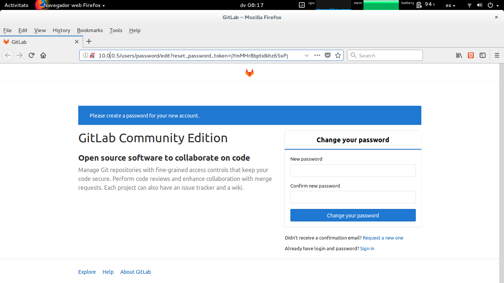

3. Next, everything is ready to sign in to Gitlab.
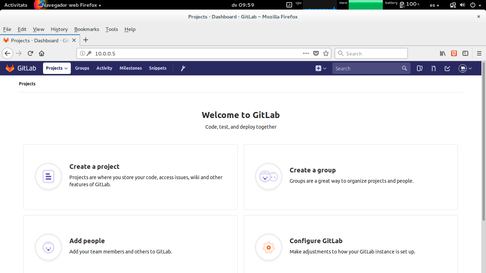

4. Its time to create a group with private visibility, named `continuousdelivery`. The article will work all the time using the recetly created group.
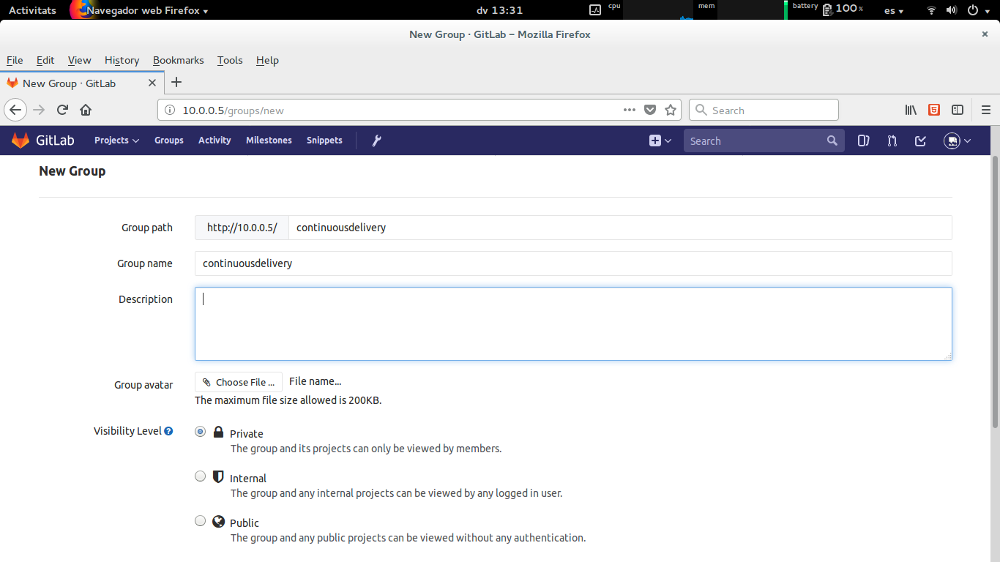

5. Under this group, create a new project. The project will be named `simple-go-helloworld` and leave the repository empty, by now.
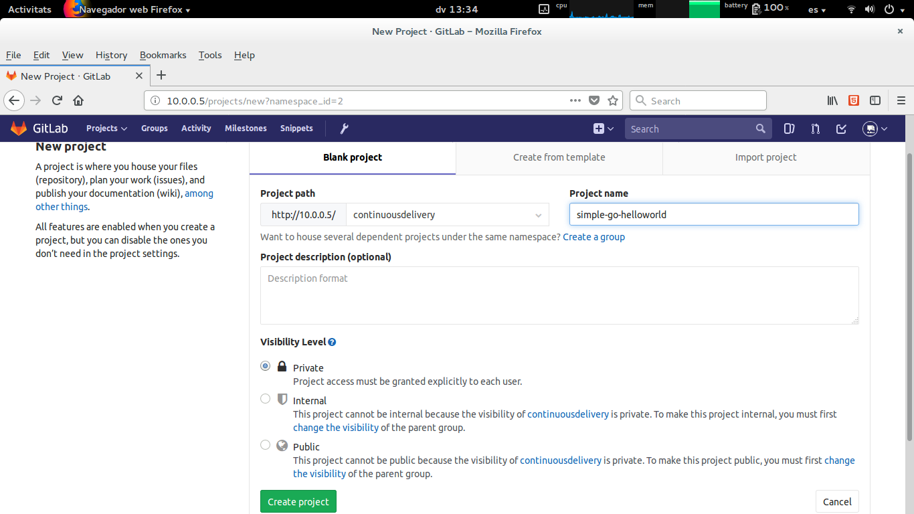

6. Create `developer`, `devops` and `jenkins` users. To do that, go to administration area and create the users.
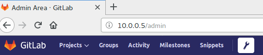

7. Configure access to `continuousdelivery` group for new users. Set user `developer` as `Manager`, `devops` as `Owner` and `jenkins` as `Guest`.
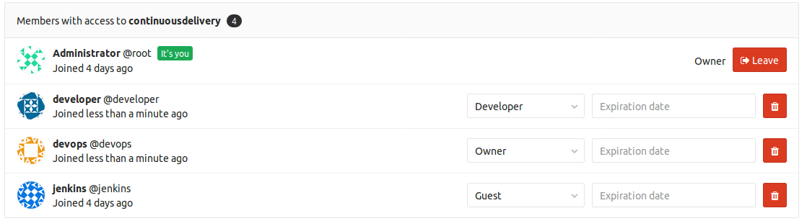

8. Following with user configuration, next step is to add the SSH keys to each user. These keys will let user to perform passwordless actions, like push code to repositories.
Then, sign in to Gitlab as `developer` user and go to `SSH Keys`, on `User Setting` configuration. Now is required a key pair for this user. 
When the environment creation, host is provided with same users as Gitlab and each user has an ssh key pair located at `~/.ssh` directory. You you use this key pair.

Copy user public key file `.ssh/id_rsa.pub` content to Gitlab SSH Key. 
The content could be extracted as below.
```shell
developer@cd:~$ cat .ssh/id_rsa.pub 
ssh-rsa AAAAB3NzaC1yc2EAAAADAQABAAACAQC/HUC1L0z1ROyE6jqPWJrM3EnYUciD9zr0S4dBYShb4MXAKB7lBbPmyp6M+Iub9c85zRmSHtZUxNBzVBFRfAxv2USMwRo7K1gIQWmAN2sBrsYfKBSv+Sty2d32p/xoTmK+tuAPqeYIkQAcRAVH6N3zxSutf4LWOIHH7SqYpZfGpvWUl8yNxhS0Xni8armmcE7ez5sH4sGgJC27JPxGM2Fz8YGWriHXcYTDK+wBmVLYsibeSar/cL1y6f6a7ycWir87MQLmUj+YnEooikkTiQUP6Hh5zsTmXstgK0+DLAtM2af3D3Q2kZJ5AVHKijP+yeUY5FtrxBJJUphQZhTPhdPzIzVPoRQ2b0Y+DtIKR4oHy9az7bVh/ZPJw1N0oo5VdBO4VVhsWm4gR9r9Ktdtj3cXoNnW+aQ2GPjsTzl1sI/YtsJD7TcBtxSSsLNiWIfs+QJPc96taDaq7TAPMYAcRfuPoUKh5F6Q9tswdFgK0dmV0HOayxBIbN6qqXRMqVcvuPijNkeO7b4CwOMquNRjBeoBt1M9C+TtefHEazVsQ/U/QaX0EKrINkLvgz859+5z4ZODvunty1nX26mZP5l21AWAVm3VcTWe6+7Zpio4+L/k/EY8WQZghMjOvkikj9oSw2rfVo8Ni4ibna6YdBZrPXko9eAh111a8Yx188aEh3dhEw== developer@cd
developer@cd:~$
```

Once you save it, the public key is already configured.
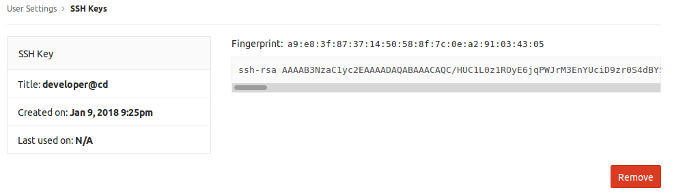

You could test the SSH configuration executing an ssh command as below. If SSH was copied properly you will receive a *Welcome to Gitlab* message.
```shell
developer@cd:~/simple-go-helloworld$ ssh -T git@10.0.0.5 -p 2222
Welcome to GitLab, developer!
```

To configure the SSH key for `devops` and `jenkins` users, you must repeat the above step for them.

9. We already have configured the users and now we will push some code on `simple-go-helloworld` repository.
The code to be pushed is located at `/developements/simple-go-helloworld` directory. Note that this code was written for [simple-go-helloworld](https://github.com/apenella/simple-go-helloworld) project.

Before push code, start a new terminal on working host, change to `developer` user, go to `/developements/simple-go-helloworld` directory, and initialize a git repository there.
You could see the commands below.
```shell
ubuntu@cd:~$ sudo su developer
developer@cd:/home/ubuntu$ cd /developements/simple-go-helloworld/
developer@cd:~/simple-go-helloworld$ git init
Initialized empty Git repository in /developements/simple-go-helloworld/.git/
```

At this moment, local workspace is ready to be used and push code to repository.
```shell
git remote add origin ssh://git@10.0.0.5:2222/continuousdelivery/simple-go-helloworld.git
git add README.md
git commit -m "Initial commit"
```
Some tips to understand the above commands.
The repository(remote) is added to local worksapce, then is added and commited the README.md file, as *Initial commit*.
Although Gitlab is configured to listen to SSH service at port 22, the remote is added to host and port 2222. That is possible because of Docker redirects connections from host's port 2222 to Gitlab's container port 22.

Once this tricky redirecton is understood, you are ready to push committed code at Gitlab.
```shell
developer@cd:~/simple-go-helloworld$ git push origin master
Counting objects: 3, done.
Delta compression using up to 2 threads.
Compressing objects: 100% (2/2), done.
Writing objects: 100% (3/3), 640 bytes | 0 bytes/s, done.
Total 3 (delta 0), reused 0 (delta 0)
To ssh://git@10.0.0.5:2222/continuousdelivery/simple-go-helloworld.git
 * [new branch]      master -> master
developer@cd:~/simple-go-helloworld$ 
```

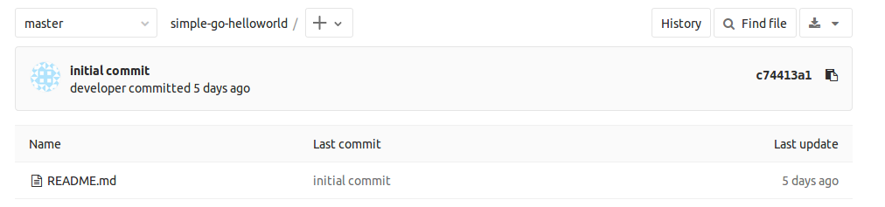

At this point we have already met the first objective: Developement team could push new features at Gitlab.

## Configure Jenkins
Let's continue our configuration with Jenkins component.
Jenkins is the engine that orchestrates and automates the actions between user and the other components, connects the developements with the operation side.

1. When the environment is already provisioned, Jenkins is published at http://10.0.0.5:8080. You will note that Jenkins' security is disabled and no user authentication is required. 
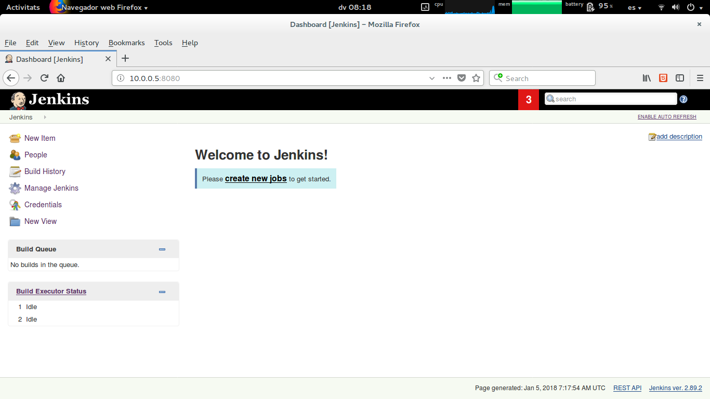

2. First, you will create a Jenkins credential to sign in to Gitlab. If you remmember, `continuousdelivery` is a Gitlab private group then, to perform any action with its repositories you must be an authorized user. Jenkins is going to be configured to sign in to Gitlab using `jenkins` user, that is this user's purpose.

To create a credential, open `Credential` management on jenkins.
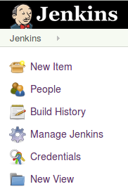

And then select `Add credential`
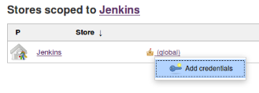

Now you must fulfill the form to create a `SSH Username with private key` credential. On that form, must be copied the jenkins user's `id_rsa` file content, located at `/srv/jenkins/.ssh`, as a direct entry private key. That file contains the `jenkins` user private key.

```shell
jenkins@cd:~/.ssh$ pwd
/srv/jenkins/.ssh
jenkins@cd:~/.ssh$ ls -la
total 16
drwx------ 2 jenkins jenkins 4096 Jan  1 19:31 .
drwxr-xr-x 3 root    root    4096 Dec 30 18:40 ..
-rw------- 1 jenkins jenkins 3243 Jan  1 19:31 id_rsa
-rw------- 1 jenkins jenkins  736 Jan  1 19:31 id_rsa.pub
```

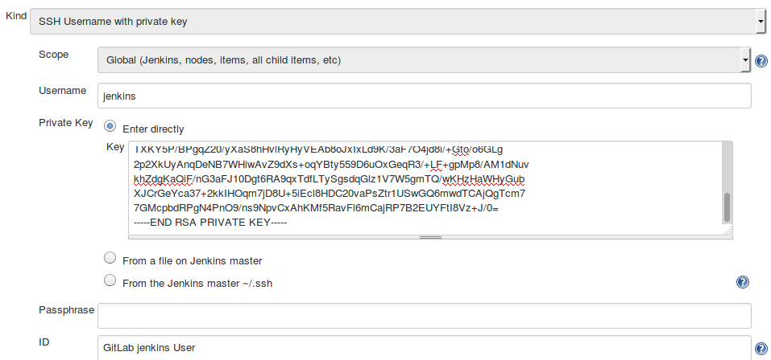

4. Create Jenkins Job
// TODO

## Putting all together
// TODO

## References
- [https://www.madetech.com/blog/continuous-delivery-with-jenkins](https://www.madetech.com/blog/continuous-delivery-with-jenkins)
- [https://www.trainingdevops.com/training-material/advance-docker-training/using-jenkins-with-docker-container](https://www.trainingdevops.com/training-material/advance-docker-training/using-jenkins-with-docker-container)
- [https://blog.philipphauer.de/tutorial-continuous-delivery-with-docker-jenkins/#setting-up-a-simple-continuous-delivery-pipeline-with-docker](https://blog.philipphauer.de/tutorial-continuous-delivery-with-docker-jenkins/#setting-up-a-simple-continuous-delivery-pipeline-with-docker)
- [https://www.atlassian.com/continuous-delivery/ci-vs-ci-vs-cd](https://www.atlassian.com/continuous-delivery/ci-vs-ci-vs-cd)

## License and Authors

Author:: Aleix Penella (aleix.penella [at] gmail.com)