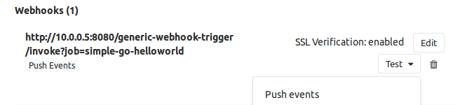

# Configure Gitlab, Jenkins and Docker Registry for Continuous delivery
In this article, is described how to configure a continuous delivery environment which uses Gitlab, Jenkins and Docker Registry. 

The objective of this article is to reproduce the following scenario:
1. Developement team pushes a new feature on GitLab.
2. Gitlab triggers a Jenkins job execution.
3. Jenkins pipeline tests and builds a new application release.
4. A new docker image is created and pushed to Docker Registry, for this release.
5. The image is ready to be deployed.

Before get to work on this article objectives, is required to have all components installed on your host. Intead of installing them one by one, I deployed [continuous_delivery](https://github.com/apenella/provisioning/tree/master/continuous_delivery) environment. Through the previous link, you could know about `continuous_delivery`, which is an environment provided with a GitLab, a Jenkins and a Docker Registry. 
Once the environment is deployed and those components are running, its time to configure each one and put them alltogether.
> Note: Next configuration will be done using default attributes described on [continuous_delivery cookbook](docs/cookbook.md).

## Configure Gitlab
We will start configuring Gitlab, which is our solution source code management.

1. When the environment is already provisioned, Gitlab is published at http://10.0.0.5. Go there.
2. Sign in to Gilab as `root`. Firts time you sign in, password have to be changed and by default, `root`'s password is `5iveL!fe`.


3. After changing `root`'s password you are ready to sign in to Gitlab.


4. Its time to create a group with private visibility, named `continuousdelivery`. In this article we will work all the time using this group.


5. Under this group, create a new project named `simple-go-helloworld` and leave it empty, by now. The code will be pushed later.


6. Create `developer`, `devops` and `jenkins` users. To do that, go to administration area and create the users.


7. Configure access to `continuousdelivery` group for each recently created user. Set user `developer` as `Master`, `devops` as `Owner` and `jenkins` as `Developer`.


8. Following with users configuration, next step is to add the SSH keys to user. Those keys will let user to perform passwordless actions, like push commits to repositories.
   Sign in to Gitlab as `developer` user and go to `SSH Keys`, on `User Setting` configuration. Now you requires a key pair for this user.
   When the environment creation, host is provided with same users as we created at Gitlab and each user has its own SSH key pair located at `~/.ssh` directory. Use those keys.

   Copy user public key file `~/.ssh/id_rsa.pub` content to Gitlab SSH Key.  

   The content could be extracted as below.  

```shell
developer@cd:~$ cat .ssh/id_rsa.pub 
ssh-rsa AAAAB3NzaC1yc2EAAAADAQABAAACAQC/HUC1L0z1ROyE6jqPWJrM3EnYUciD9zr0S4dBYShb4MXAKB7lBbPmyp6M+Iub9c85zRmSHtZUxNBzVBFRfAxv2USMwRo7K1gIQWmAN2sBrsYfKBSv+Sty2d32p/xoTmK+tuAPqeYIkQAcRAVH6N3zxSutf4LWOIHH7SqYpZfGpvWUl8yNxhS0Xni8armmcE7ez5sH4sGgJC27JPxGM2Fz8YGWriHXcYTDK+wBmVLYsibeSar/cL1y6f6a7ycWir87MQLmUj+YnEooikkTiQUP6Hh5zsTmXstgK0+DLAtM2af3D3Q2kZJ5AVHKijP+yeUY5FtrxBJJUphQZhTPhdPzIzVPoRQ2b0Y+DtIKR4oHy9az7bVh/ZPJw1N0oo5VdBO4VVhsWm4gR9r9Ktdtj3cXoNnW+aQ2GPjsTzl1sI/YtsJD7TcBtxSSsLNiWIfs+QJPc96taDaq7TAPMYAcRfuPoUKh5F6Q9tswdFgK0dmV0HOayxBIbN6qqXRMqVcvuPijNkeO7b4CwOMquNRjBeoBt1M9C+TtefHEazVsQ/U/QaX0EKrINkLvgz859+5z4ZODvunty1nX26mZP5l21AWAVm3VcTWe6+7Zpio4+L/k/EY8WQZghMjOvkikj9oSw2rfVo8Ni4ibna6YdBZrPXko9eAh111a8Yx188aEh3dhEw== developer@cd
developer@cd:~$
```

   Once you save it, the public key is already configured, and you could push new commits to Gitlab using `developer` user.  


   It is possible to test the SSH configuration executing an ssh command as below. If public key was copied properly you will receive a *Welcome to Gitlab* message.

```shell
developer@cd:~/simple-go-helloworld$ ssh -T git@10.0.0.5 -p 2222
Welcome to GitLab, developer!
```

> Configure the SSH keys for `devops` and `jenkins` users as we did with `developer` one.

9. We already have configured the users and now we will push some code to `simple-go-helloworld` repository.
   The code to be pushed is located at `/developements/simple-go-helloworld` directory. Note that this code was written for [simple-go-helloworld](https://github.com/apenella/simple-go-helloworld) project.

   Before push any code, start a new terminal at working host, change to `developer` user, go to `/developements/simple-go-helloworld` directory, and initialize a git repository there.
   You could do that following next commands below.

```shell
ubuntu@cd:~$ sudo su developer
developer@cd:/home/ubuntu$ cd /developements/simple-go-helloworld/
developer@cd:~/simple-go-helloworld$ git init
Initialized empty Git repository in /developements/simple-go-helloworld/.git/
```

   When workspace is initialized, now you should set up user configuration for git as below.

```shell
developer@cd:~/simple-go-helloworld$ git config --global user.email "developer@continuousdelivery.learn"
developer@cd:~/simple-go-helloworld$ git config --global user.name "Developer"
```

   Finally, the current workspace should be associated to Gitlab's repository adding it as a remote.

```shell
git remote add origin ssh://git@10.0.0.5:2222/continuousdelivery/simple-go-helloworld.git
git add README.md
git commit -m "Initial commit"
```

   At this moment, local workspace is ready to be used and push new commits to repository.
   Although Gitlab is configured to listen to ssh service at port 22, the remote is added using port 2222 to avoid port conflicts with host. The `add remote` command is working because Docker redirects connections from host's port 2222 to Gitlab's container port 22.

   Once this tricky redirecton is understood, you are ready to push committed code at Gitlab.

```shell
developer@cd:~/simple-go-helloworld$ git push origin master
Counting objects: 3, done.
Delta compression using up to 2 threads.
Compressing objects: 100% (2/2), done.
Writing objects: 100% (3/3), 640 bytes | 0 bytes/s, done.
Total 3 (delta 0), reused 0 (delta 0)
To ssh://git@10.0.0.5:2222/continuousdelivery/simple-go-helloworld.git
 * [new branch]      master -> master
developer@cd:~/simple-go-helloworld$ 
```


At this point we have already met our first objective: Developement team could push new features at Gitlab.

## Configure Jenkins
Let's continue with Jenkins component configuration.
Jenkins is the engine that automates user actions, connecting developements with the operation side.

1. Once the environment is already provisioned, Jenkins is published at http://10.0.0.5:8080. When you load Jenkins web console on you browser, you will note that Jenkins' security is disabled and no user authentication is required.


2. First, you will create a Jenkins credential to sign in to Gitlab and checkout code from its repositories. Jenkins is going to be configured to sign in to Gitlab using `jenkins` user. If you remmember, `jenkins` user is a `continuousdelivery` group member in Gitlab, then he could perform some actions with its repositories.

   To create a credential, open `Credential` management on jenkins.


   And then select `Add credential`


   Now you must fulfill the form to create a `SSH Username with private key` credential. On that form, must be copied host's jenkins user `id_rsa` file content, located at `/srv/jenkins/.ssh` to Jenkins credential. This file contains host's jenkins user private key. Jenkins credential will be set as a direct entry private key.
   As it was explained before, during the environment deployment there was created a set of users, and those users have its own key pairs.

```shell
jenkins@cd:~/.ssh$ pwd
/srv/jenkins/.ssh
jenkins@cd:~/.ssh$ ls -la
total 16
drwx------ 2 jenkins jenkins 4096 Jan  1 19:31 .
drwxr-xr-x 3 root    root    4096 Dec 30 18:40 ..
-rw------- 1 jenkins jenkins 3243 Jan  1 19:31 id_rsa
-rw------- 1 jenkins jenkins  736 Jan  1 19:31 id_rsa.pub
```


4. It is time to create our Jenkins' job. To do that, go to `create a new job` on Jenkins' main page.


> When Jenkins master image is created during the environment deployment, the required Jenkins' plugins to accomplish this articles objectives are installed.

   The job to be created will be named `simple-go-helloworld` and is going to be a `pipeline` job.


   Job has to be enabled the parametrization, and a parameter to identify Docker Registry must be added. This parameter will be an string type parameter named `DOCKER_REGISTRY`, having `10.0.0.5:5000` as default value. `Jenkinsfile` groovy script looks for this parameter and if it is not set, the image will not be deployed to any Docker Registry.


   Now, its time to define Jenkins pipeline. 
   Gitlab's project has a file named `Jenkinsfile`, where is defined the pipeline that automates each step to test, build and deploy a new release to Docker Registry. 
   To use repository's `Jenkinsfile`, pipeline definition must be set as `Pipeline script from SCM`. This configuration requires a git repository, and here must set our Gitlab's repository url: `ssh://git@10.0.0.5:2222/continuousdelivery/simple-go-helloworld.git`. Gitlab's jenkins user credentials, created before, must be also set up to get in our repository.


> You could take a look of `Jenkinsfile` [here](https://github.com/apenella/provisioning/blob/master/continuous_delivery/files/default/test/simple-go-helloworld/Jenkinsfile).

   At this moment, everything is ready to build the jenkins project. Before run this job, Jenkins will ask for to set defined parameters. Keep DOCKER_REGISTRY parameter value as default.


   After a while, all the steps defined on `Jenkinsfile` will be executed and the new image will be deployed and ready to use on Docker Registry.


   You could check deployed release's image on Registry UI (crane operator). 


If you have arribed at this point it means that developement team could pushes new commits to Gitlab and new releases could be test, build and deployed to Docker Registry, from Jenkins. To round our work and achive this article objectives we still require one more thing, to automate the release deployment as soon as it is pushed to Gitlab.

## Connect Gitlab and Jenkins
As I said before, we have not already accomplished all the objectives defined at the beging of this article.
Let's review article objectives:
1. Developement team pushes a new feature on GitLab.
2. Gitlab triggers a Jenkins job execution.
3. Jenkins pipeline tests and builds a new application release.
4. A new docker image is created and pushed to Docker Registry, for this release.
5. The image is ready to be deployed.

How we run a Jenkins job once the developement team pushes a new feature to Gitlab?
We will do that using the `Generic Webhook trigger` Jenkins's plugin. 

1. Modify job to use `Generic Webhook trigger` Jenkins's plugin. 
   This plugin is installed on the environment deployment, then we only have to configure the `simple-go-helloworld`'s job to enable `Generic Webhook trigger` on Jenkins' `Build Triggers` section. When is enabled this setting, we should add a request parameter named `job` and `simple-go-helloworld` as its value.


   Although its not a best practice, I decided to use a request parameter for generic webhook because its simple to configure and understand. 

   When `Generic Webhook trigger` parameter is already configured, Jenkins' job could be started using next url: `http://10.0.0.5:8080/generic-webhook-trigger/invoke?job=simple-go-helloworld`

```shell
developer@cd:~$ curl http://10.0.0.5:8080/generic-webhook-trigger/invoke?job=simple-go-helloworld
{"status":"ok","data":{"triggerResults":{"simple-go-helloworld":{"id":2,"regexpFilterExpression":"","regexpFilterText":"","resolvedVariables":{"job":"","job_0":""},"searchName":"API","searchUrl":"api","triggered":true,"url":"queue/item/2/"}}}}
```

2. Configure Gitlab's integration trigger.
   To configure Gitlab to start Jenkins' `simple-go-helloworld` job after a push to `simple-go-helloworld` repository, sign in to Gitlab and go to repository settings. You could sign in as `developer`user.

   Add the job's invocation url on repository set up.


   Select to trigger it after a push event.


   Finally, add the webhook to repository.


   Its possible to test the configured webhook from Gitlab's integration settings.


   You could check the deployed image result staring a container which uses this image.

```shell
developer@cd:~$ docker run --rm -p 8081:80 10.0.0.5:5000/simple-go-helloworld:latest
```

   The result of running our new application could be seen below.


## Putting all together
At this point we have achived our article objective but let's putting all together. 

1. To do that, we will modify our `main.go` file, changing the background message color, and then push changes to Gitlab.

```shell
developer@cd:~/simple-go-helloworld$ git add main.go 
developer@cd:~/simple-go-helloworld$ git commit -m "Changed background message color"
[master dbd001b] Changed background message color
 1 file changed, 2 insertions(+), 2 deletions(-)
developer@cd:~/simple-go-helloworld$ git push origin master
Counting objects: 3, done.
Delta compression using up to 2 threads.
Compressing objects: 100% (3/3), done.
Writing objects: 100% (3/3), 324 bytes | 0 bytes/s, done.
Total 3 (delta 2), reused 0 (delta 0)
To ssh://git@10.0.0.5:2222/continuousdelivery/simple-go-helloworld.git
   76efefa..dbd001b  master -> master
developer@cd:~/simple-go-helloworld$ 
```

2. Once this change is pushed to Gitlab, it triggers the `simple-go-helloworld` Jenkins job. It is possible to review it on job's building history.


3. Last release is also available on Docker Registry. If you go to Registry UI(crane operator) at `http://10.0.0.5:5080` you will see that last build is already deployed.


4. When you start a new container, using the latest `simple-go-helloworld` image, you could see the lastest release of our application in your browser, at `http://10.0.0.5:8081`.

```shell
developer@cd:~$ docker run --rm -p 8081:80 10.0.0.5:5000/simple-go-helloworld:latest
```

5. And that is the result which assures that everything is working as we wished.


Congratulations!

## References
- [https://www.madetech.com/blog/continuous-delivery-with-jenkins](https://www.madetech.com/blog/continuous-delivery-with-jenkins)
- [https://www.trainingdevops.com/training-material/advance-docker-training/using-jenkins-with-docker-container](https://www.trainingdevops.com/training-material/advance-docker-training/using-jenkins-with-docker-container)
- [https://blog.philipphauer.de/tutorial-continuous-delivery-with-docker-jenkins/#setting-up-a-simple-continuous-delivery-pipeline-with-docker](https://blog.philipphauer.de/tutorial-continuous-delivery-with-docker-jenkins/#setting-up-a-simple-continuous-delivery-pipeline-with-docker)
- [https://www.atlassian.com/continuous-delivery/ci-vs-ci-vs-cd](https://www.atlassian.com/continuous-delivery/ci-vs-ci-vs-cd)

## License and Authors

Author:: Aleix Penella (aleix.penella [at] gmail.com)